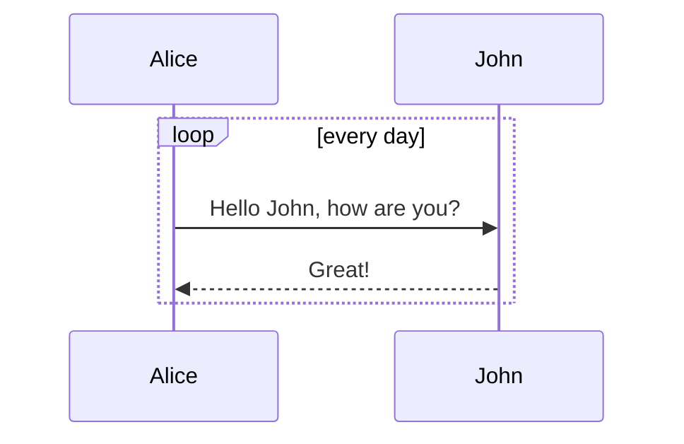

# 📋 📘 Boostnote Markdown CheatSheet

The missing markdown feature cheat sheet for [Boostnote](https://boostnote.io/).  
It tries to give a short summary of all formatting options which are available in Boostnote.

---
:warning: Only works in Boostnote.  
:point_right: Open the [Preview Page](README.md) to see how it's rendered.  
:u5408: [Chinese Version](README_zh_cn.md)

---
### :information_source: How to add it to Boostenote
1. Open the [RAW](https://raw.githubusercontent.com/TobseF/boostnote-markdown-cheatsheet/master/BOOSTNOTE_MARKDOWN_CHEAT_SHEET.md) version of this file. 
2. Copy it with [[crtl]] + [[a]] and [[crtl]] + [[c]]
3. Create an empty _Markdown Note_ in Bosstnote paste it with  
   [[crtl]] + [[shift]] + [[v]]  
   (The *shift* is important to skip escaping)
---

<!-- Auto generated table of contents (TOC) -->

[TOC]

<!-- tocstop -->
> *Table of Contens generated by:*
> `Shortcut:` [[Shift]]+[[ctrl]]+[[T]]
> `Menu:`  _File / Generate / Update Markdown TOC_

## Text Formatting

### Emphasis
*Italic type*
**Bold**
~~Negative~~
`highlighted`

### Abbreviation
The HTML specification
is maintained by the W3C.
*[HTML]: Hyper Text Markup Language
*[W3C]: World Wide Web Consortium

### Superscript
H~2~0
29^th^

### Link
`Simple link`:  https://en.wikipedia.org/wiki/Microsoft_Notepad  
`Named link`:   [Boostnote](https://boostnote.io)  
`Tooltip link`: [Hover Me](https://boostnote.io "A cool tooltip")  
`Jump to line`: [Go to line 200](:line:200)

### Check box
- [x] Task 1
- [ ] Task 2

### Quotation
> Quotation
> Quotation Quotation

### Footnotes
Here is a footnote reference,[^1] and another.[^longnote]

[^1]: Here is the footnote.
[^longnote]: Here's one with multiple blocks.

    Subsequent paragraphs are indented to show that they
belong to the previous footnote.

### Html
<span style="color:green">Green Text</span>
<span style="color:yellow">Yellow Text</span>
<u>underlined</u>
> HTML only works if you enable:
> Menu: _Preferences / Interface / Preview / Sanitization / Allow dangerous html tags_

### Emoticons
Emoji by shortcode: :books: :memo: :eyes:
Emoji by Unicode:   📚 📝 👀
[complete emoji list](https://www.webpagefx.com/tools/emoji-cheat-sheet/)

### Smart Arrows
--> →  
<-- ←  
<-> ↔  
==> ⇒  
<== ⇐  
<==> ⇔

> Smart arrows only work if you enable:  
> Menu: _Preferences / Interface / Preview / Sanitization / Convert textual arrows to beautiful signs_  
> ⚠ This will interfere with using HTML comments in your Markdown.

### Keystrokes
[[Esc]] [[z]]

### Source Code

```js
Render: function () {
  Return (
    <Div className = “commentBox”>
      <H1> Comments </ H1>
      <CommentList data = {this.state.data} />
      <CommentForm onCommentSubmit = {this.handleCommentSubmit} />
    </Div>
  );
}
```

## Structuring

### List
* List 1
* List 2
1. First ordered list item
 Second line
2. Another item

### Definition list

Term 1
~ Definition 1
Term 2
~ Definition 2a
~ Definition 2b
Term 3
~ 
Term 1
: Definition 1
Term 2 with \*inline markup\*
: Definition 2

         { some code, part of Definition 2 }
    Third paragraph of definition 2.

### Table
| Tables        | Are           | Cool  |
| :------------ |:-------------:| -----:|
| col 3 is      | right-aligned | $1600 |
| col 2 is      | centered      |   $12 |
| zebra stripes | are neat      |    $1 |
|             |          Grouping           ||


|First Header  | Second Header | Third Header |
| ------------ | :-----------: | -----------: |
|Content       |          *Long Cell*        ||
|Content       |   **Cell**    |         Cell |
|New section   |     More      |         Data |
|And more      | With an escaped '\\|'       ||
[Table description]

Markdown | Less | Pretty
--- | --- | ---
*Still* | `renders` | **nicely**
1 | 2 | 3

> There must be at least 3 dashes separating each header cell.
The outer pipes (|) are optional, and you don't need to make the
raw Markdown line up prettily. You can also use inline Markdown.

### Block
	Some Infor First Line - Lorem ipsum dolor sit amet, consetetur sadipscing eli
	Some Infor Second Line - Lorem ipsum dolor sit amet, consetetur sadipscing eli
	Some Infor Third Line - Lorem ipsum dolor sit amet, consetetur sadipscing eli

### Fold
<details><summary>Boostnote is a notepad corresponding to markdown notation, which is a tool for organizing and sharing information.</summary>
- Features - <br>
· Search function to find memos in one shot
· Supports markdown notation <br>
· Support for Mac, Windows, Linux, iOS, Android <br>
· Export and import to Plain text (.txt), Markdown (.md) format <br>
· Supports PDF saving <br>
· Can be used offline <br>
· Synchronize to dropbox etc. with setting <br>
* Supports theme colors and numerous fonts<br>
</details>

### Horizontal line
Horizontal lines have various ways of writing.
* * *
***
---

### Admonition

!!! note Note
Lorem ipsum
!!!

!!! hint Hint
Lorem ipsum
!!!

!!! question Question
Lorem ipsum
!!!

!!! quote Quote
Lorem ipsum
!!!

!!! abstract Abstract
Lorem ipsum
!!!

!!! attention Attention
Lorem ipsum
!!!

!!! caution Caution
Lorem ipsum
!!!

!!! error Error
Lorem ipsum
!!!

!!! danger Danger
Lorem ipsum
!!!

## Image
`Default:` 
`Resized:` 
`Streched:` 
`By Reference:` ![Referneced Style][logo]

[logo]: https://raw.githubusercontent.com/BoostIO/Boostnote/master/resources/app.png "Boostnote Logo"

### Gallery
```gallery(42h)
https://source.unsplash.com/F8mUf0hjf74/1024x600
https://source.unsplash.com/-StqtXU35cA/1024x600
https://source.unsplash.com/BLTcKiKXbzU/1024x600
https://source.unsplash.com/qh1J3d4QzgA/1024x600
https://source.unsplash.com/rpvhOzyv2jM/1024x600
```
> Use `gallery(autoplay=2000)` for 2 seconds image rotation.

## Latex
$$[x^n + y^n = z^n]$$
$$\frac{d}{dx}\left( \int_{0}^{x} f(u)\,du\right)=f(x).$$

## Diagram Integrations

### [Flowchart](http://flowchart.js.org/)
```flowchart
st=>start: Start:>http://www.google.com[blank]
e=>end:>http://www.google.com
op1=>operation: My Operation
sub1=>subroutine: My Subroutine
cond=>condition: Yes or No?:>http://www.google.com
io=>inputoutput: catch something…
st->op1->cond
cond(yes)->io->e
cond(no)->sub1(right)->op1
```

### [Sequence](https://bramp.github.io/js-sequence-diagrams/)
```sequence
Title: Here is a title
A -> B: Normal line
B --> C: Dashed line
C ->> D: Open arrow
D -->> A: Dashed open arrow
```

### [mermaid](https://mermaidjs.github.io/)


### Chart

```chart(yaml)
type: pie
data:
  labels:
  - Red
  - Blue
  - Yellow
  datasets:
  - data:
    - 300
    - 50
    - 100
    backgroundColor:
    - "#FF6384"
    - "#36A2EB"
    - "#FFCE56"
    hoverBackgroundColor:
    - "#FF6384"
    - "#36A2EB"
    - "#FFCE56"
```

### [Ditaa](http://ditaa.sourceforge.net/)

@startditaa
/--------\   +-------+
|cAAA    +---+Version|
|  Data  |   |   V3  |
|  Base  |   |cRED{d}|
|     {s}|   +-------+
\---+----/


+---+-----+   +----------+
| cBLU    |   | {io}     |
| Ext-Foo |   |  S-ATA   |
|   +-----+   |   cFEA   |
|   |cPNK |   +----------+
|   | Foo |
+---+-----+
@endditaa

@startditaa
                   +-------------+
                   | Asciidoctor |-------+
                   |   diagram   |       |
                   +-------------+       | PNG out
                       ^                 |
                       | ditaa in        |
                       |                 v
 +--------+   +--------+----+    /---------------\
 |        | --+ Asciidoctor +--> |               |
 |  Text  |   +-------------+    |   Beautiful   |
 |Document|   |   !magic!   |    |    Output     |
 |     {d}|   |             |    |               |
 +---+----+   +-------------+    \---------------/
     :                                   ^
     |          Lots of work             |
     +-----------------------------------+
@endditaa

### [Plant UML](http://plantuml.com/)

#### [Class Diagram](https://plantuml.com/class-diagram)
@startuml
Object <|-- ArrayList
Object : + equals()
ArrayList : - Object[] elementData
ArrayList : + size()
@enduml

#### [Activity Diagram](https://plantuml.com/activity-diagram-beta)
@startuml
start
:Hello world;
:This is on defined on
several **lines**;
stop
@enduml

#### [Sequence Diagram](https://plantuml.com/sequence-diagram)
@startuml
Alice -> "Bob()" : Hello
"Bob()" -> "This is very \n long" as Long
' You can also declare:
' "Bob()" -> Long as "This is very \n long"
Long --> "Bob()" : ok
@enduml

#### [MindMap](https://plantuml.com/mindmap-diagram)
@startmindmap
* Debian
** Ubuntu
*** Linux Mint
*** Kubuntu
*** Lubuntu
*** KDE Neon
** LMDE
** SolydXK
** SteamOS
** Raspbian with a very long name
*** <s>Raspmbc</s> => OSMC
*** <s>Raspyfi</s> => Volumio
@endmindmap

#### [Work Breakdown Structure](https://plantuml.com/wbs-diagram)
@startwbs
+ Project
 + Part One
  + Task 1.1
   - LeftTask 1.2
   + Task 1.3
  + Part Two
   + Task 2.1
   + Task 2.2
   -_ Task 2.2.1 To the left boxless
   -_ Task 2.2.2 To the Left boxless
   +_ Task 2.2.3 To the right boxless
@endwbs

#### [Gantt Diagram](https://plantuml.com/gantt-diagram)
@startgantt
[Prototype design] lasts 10 days
[Code prototype] lasts 10 days
[Write tests] lasts 5 days
[Code prototype] starts at [Prototype design]'s end
[Write tests] starts at [Code prototype]'s start
@endgantt