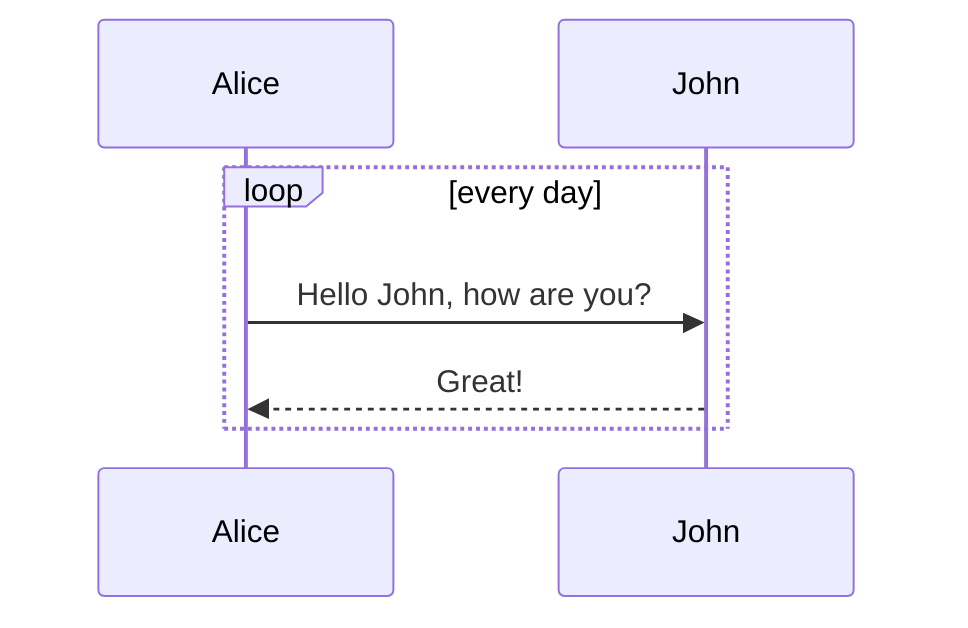

# 📋 📘 Boostnote Markdown 备忘录

[Boostnote](https://boostnote.io/). 中鲜为人知的 Markdown 特性
这份备忘录提供了Boostnote中所有可用格式选项的简短说明

---
:warning: 只在 Boostnote 中 有效
:point_right: 打开 [预览](README.md) 来查看渲染情况
:capital_abcd: [English Version](README.md)
---

<!-- Auto generated table of contents (TOC) -->

[TOC]

<!-- tocstop -->
> *目录由以下方式生成:*
> `快捷键:` [[Shift]]+[[ctrl]]+[[T]]
> `菜单:`  _文件 / Generate / Update Markdown TOC_

## 文本格式化

### 强调
*斜体*
**加粗**
~~删除线~~
`高亮`


### 缩写
鼠标悬停在某些单词上时可以显示全文
HTML 由 W3C 维护
*[HTML]: 超文本标记语言
*[W3C]: World Wide Web Consortium

HTML
W3C

### 角标
H~2~0
29^th^

### 链接
`简单链接`:  https://en.wikipedia.org/wiki/Microsoft_Notepad  
`命名链接`:   [Boostnote](https://boostnote.io)  
`自动链接`: - google.com  
`跳转至200行`: [Go to line 200](:line:200)


### 复选框
- [x] 任务 1
- [ ] 任务 2

### 引用
> 引用
> 引用 引用

### 脚注
这是一个脚注引用[^1]和另一个脚注[^longnote]

[^1]: 这是一个脚注
[^longnote]: 这是另一个脚注

### Html
<span style="color:green">绿色文本</span>
<span style="color:yellow">黄色文本</span>
<u>underlined</u>
> HTML 只有在你启用下面的设置才会生效:
> Menu: _Preferences / Interface / Preview / Sanitization / Allow dangerous html tags_

### 表情符号
Emoji 短码: :books: :memo: :eyes:
Emoji Unicode:   📚 📝 👀
[完整Emoji列表](https://www.webpagefx.com/tools/emoji-cheat-sheet/)

### 箭头
--> →
<-- ←
<-> ↔
==> ⇒
<== ⇐
<==> ⇔

> 智能箭头只有开启以下设置才会生效:
> Menu: _Preferences / Interface / Preview / Sanitization / Convert textual arrows to beautiful signs_
> ⚠ This will interfere with using HTML comments in your Markdown.
>

### 键盘
[[Esc]] [[z]]

### 源码

```js
Render: function () {
  Return (
    <Div className = “commentBox”>
      <H1> Comments </ h1>
      <CommentList data = {this.state.data} />
      <CommentForm onCommentSubmit = {this.handleCommentSubmit} />
    </Div>
  );
}
```

## 结构化

### 列表
* 列表项 1
* 列表项 2
1. 有序列表第一项
 第二行
2. 另一个列表项

### 定义列表

项目 1
~ 定义1 1
项目 2
~ 定义 2a
~ 定义 2b
项目 3
~

项目 1
: 定义 1
项目 2 \*行内标记\*
: 定义 2

         { 一些代码，定义 2 的一部分 }
    定义 2 第三段

### 表格
| 表格    |    很    |    酷 |
| :------ | :------: | ----: |
| 列 3 是 | 右对齐的 | $1600 |
| 列 2 is | 中间对齐 |   $12 |
| 斑马线  | 是必须的 |    $1 |
|         |   跨列   ||


| First Header |     Second Header     | Third Header |
| ------------ | :-------------------: | -----------: |
| Content      |      *Long Cell*      |
| Content      |       **Cell**        |         Cell |
| New section  |         More          |         Data |
| And more     | With an escaped '\\|' |
[Table description]

| Markdown | Less      | Pretty     |
| -------- | --------- | ---------- |
| *Still*  | `renders` | **nicely** |
| 1        | 2         | 3          |

> 至少需要 3 个破折线来分割每个 header
最外的管道符号 | 是可选的，你无需手动格式化原始 Markdown 。你也可以使用行内 Markdown

### 块
	Some Infor First Line - Lorem ipsum dolor sit amet, consetetur sadipscing eli
	Some Infor Second Line - Lorem ipsum dolor sit amet, consetetur sadipscing eli
	Some Infor Third Line - Lorem ipsum dolor sit amet, consetetur sadipscing eli

### 折叠
<details><summary>Boostnote 是一个 Markdown 记事本，也是一个用于管理和分享信息的工具</summary>
- 特性 - <br>
· 一次性查找备忘录的搜索共呢个
· 支持 Markdown <br>
· 支持 Mac, Windows, Linux, iOS, Android <br>
· 导入或导出普通文本 (.txt), Markdown (.md) 格式 <br>
· 支持PDF保存 <br>
· 支持离线使用 <br>
· 支持使用dropbox同步，也可在设置中使用其他网盘工具 <br>
* 支持多种主题颜色和字体<br>
</details>

### 水平分割线
水平分割线由以下几种写法
* * *
***
---

### 警示内容

!!! note 要点标题
要点内容
!!!

!!! hint 提示标题
提示内容
!!!

!!! caution 警告标题
警告内容
!!!

!!! error 错误标题
错误内容
!!!

!!! attention 注意标题
注意内容
!!!

!!! danger 危险标题
危险内容
!!!

## 图像
`默认:` 
`重置大小:` 
`拉伸:` 
`引用:` ![Referneced Style][logo]

[logo]: https://raw.githubusercontent.com/BoostIO/Boostnote/master/resources/app.png "Boostnote Logo"

## Latex
$$[x^n + y^n = z^n]$$
$$\frac{d}{dx}\left( \int_{0}^{x} f(u)\,du\right)=f(x).$$

## 图像集成

### 流程图
```flowchart
st=>start: Start:>http://www.google.com[blank]
e=>end:>http://www.google.com
op1=>operation: My Operation
sub1=>subroutine: My Subroutine
cond=>condition: Yes or No?:>http://www.google.com
io=>inputoutput: catch something…
st->op1->cond
cond(yes)->io->e
cond(no)->sub1(right)->op1
```

### 序列图
```sequence
Title: Here is a title
A-> B: Normal line
B --> C: Dashed line
C ->> D: Open arrow
D -->> A: Dashed open arrow
```

### [mermaid](https://mermaidjs.github.io/)


### 图表

```chart(yaml)
type: pie
data:
  labels:
  - Red
  - Blue
  - Yellow
  datasets:
  - data:
    - 300
    - 50
    - 100
    backgroundColor:
    - "#FF6384"
    - "#36A2EB"
    - "#FFCE56"
    hoverBackgroundColor:
    - "#FF6384"
    - "#36A2EB"
    - "#FFCE56"
```

### [Ditaa](http://ditaa.sourceforge.net/)

@startditaa
/--------\   +-------+
|cAAA    +---+Version|
|  Data  |   |   V3  |
|  Base  |   |cRED{d}|
|     {s}|   +-------+
\---+----/


+---+-----+   +----------+
| cBLU    |   | {io}     |
| Ext-Foo |   |  S-ATA   |
|   +-----+   |   cFEA   |
|   |cPNK |   +----------+
|   | Foo |
+---+-----+
@endditaa

@startditaa
                   +-------------+
                   | Asciidoctor |-------+
                   |   diagram   |       |
                   +-------------+       | PNG out
                       ^                 |
                       | ditaa in        |
                       |                 v
 +--------+   +--------+----+    /---------------\
 |        | --+ Asciidoctor +--> |               |
 |  Text  |   +-------------+    |   Beautiful   |
 |Document|   |   !magic!   |    |    Output     |
 |     {d}|   |             |    |               |
 +---+----+   +-------------+    \---------------/
     :                                   ^
     |          Lots of work             |
     +-----------------------------------+
@endditaa

### [Plant UML](http://plantuml.com/)
@startuml
participant Last order 30
participant Middle order 20
participant First order 10
@enduml

@startuml
Alice -> "Bob()" : Hello
"Bob()" -> "This is very\\nlong" as Long
' You can also declare:
' "Bob()" -> Long as "This is very\\nlong"
Long --> "Bob()" : ok
@enduml
